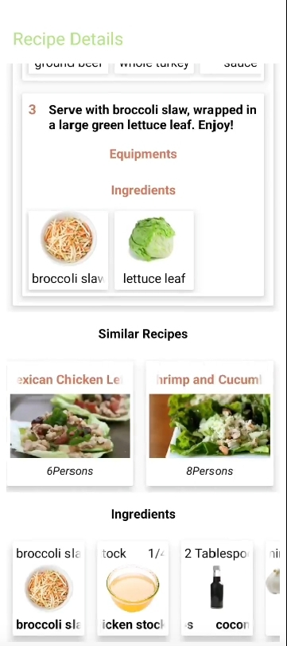
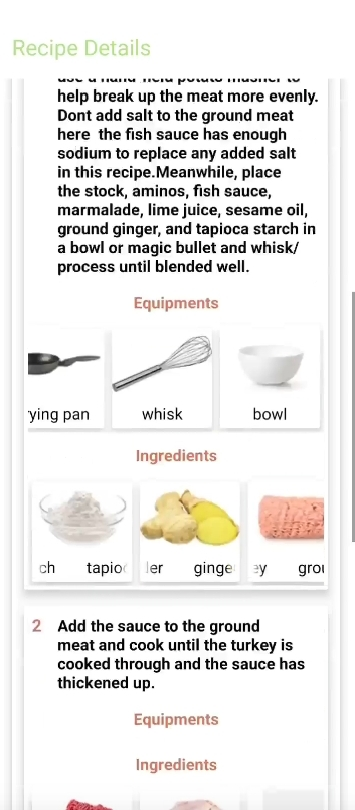
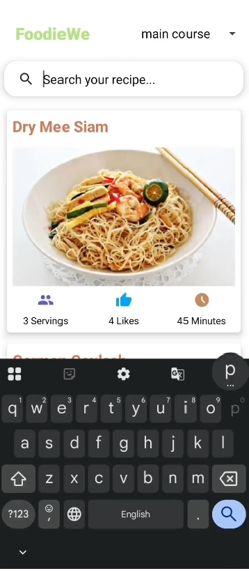
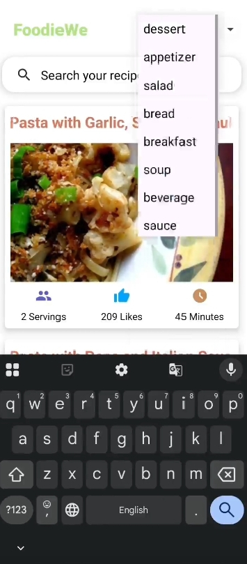

# FoodieWe - Recipe App

FoodieWe is a simple Android Recipe App built using **Retrofit** and the **Spoonacular API**.  
Search, explore, and view detailed recipes — all in one app!

---

## 🚀 Features
- Browse recipes from Spoonacular API  
- Search recipes by name  
- View detailed recipe info (ingredients, instructions, etc.)  
- Modern UI built with Android XML and Java  
- API integration using Retrofit  

---

## 🛠️ Tech Stack
- **Frontend:** Java, XML (Android Studio)
- **Backend/API:** Spoonacular API
- **Networking:** Retrofit
- **Image Loading:**  Picasso 

---

## App Screenshots
<p align="center">
   
  
 

</p>


## 🧠 How to Use
1. Clone this repository  
   ```bash
   git clone https://github.com/Anisha956/RecipeApp.git
2. Open in Android Studio

3. Add your own Spoonacular API key in local.properties

4. Run the app on emulator or device

##👩‍💻 Author
**Anisha Bisht**
[LinkedIn] (https://www.linkdin.com/in/anisha-bisht)
[GitHub] (https://github.com/Anisha956)
   
